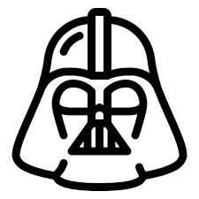
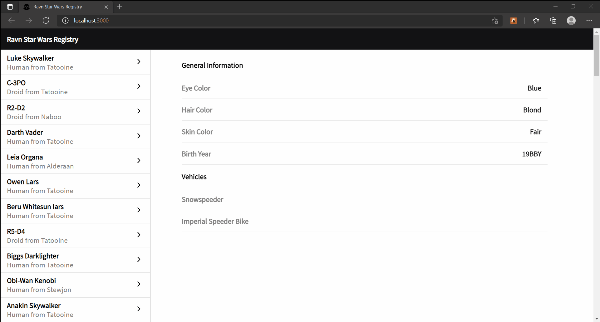
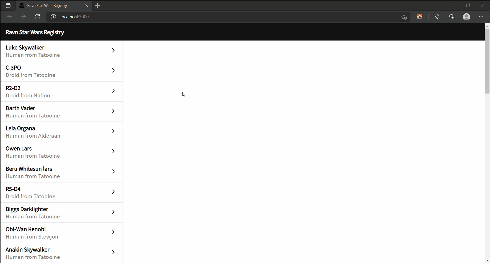
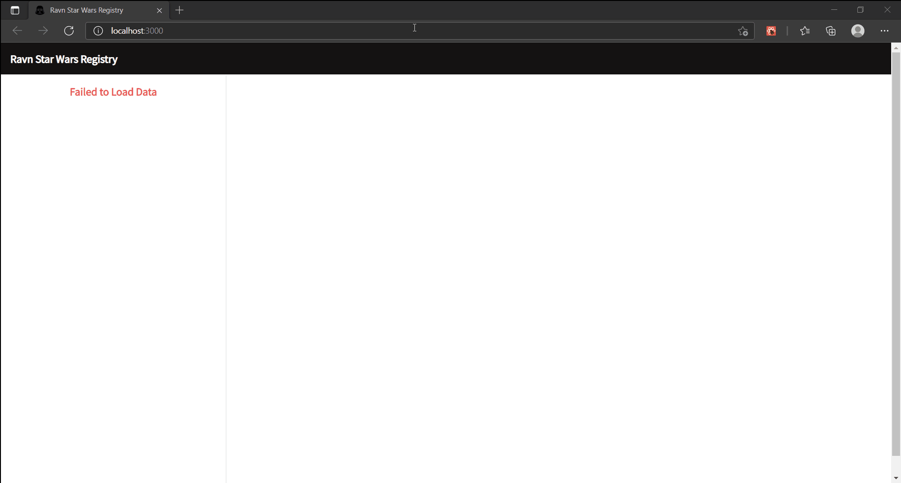

<!-- PROJECT LOGO -->
<br />
<p align="center">
  <a href="https://github.com/AckerCoder/Ravn-Challenge-V2-Miguel-Zegarra">
    
  </a>

  <h3 align="center">Hi! This is a challenge made by Miguel Zegarra for Ravn</h3>

  <p align="center">
    The challenge was about of building an app with GraphQL, Apollo and other optional technologies. The app is a Star Wars Character Registry powered by https://swapi-graphql.netlify.app/ I have chosen ReactJS for a bunch reasons, but the most important is because it's very simple to compile and do some changes while you are working with an API.
    <br />
    <br />
    <br />
  </p>
</p>


<!-- ABOUT THE PROJECT -->
## About The Project
We use React and Apollo to build a powerful Star Wars Registry!

### Built With

* [ReactJS](https://reactjs.org/)
* [Apollo Client](https://www.apollographql.com/)
* [GraphQL](https://graphql.org/)
* [SCSS](https://sass-lang.com/)


<!-- GETTING STARTED -->
## Getting Started

To get a local copy up and running follow these simple steps.

### Prerequisites
You must have npm or yarn installed to run this project.

### Installation

1. Clone the repo
```sh
git clone https://github.com/AckerCoder/Ravn-Challenge-V2-Miguel-Zegarra.git
```
2. Install packages
```sh
yarn install
```
3. Run the project
```sh
yarn start
```
### Project Structure
 ```
  src
  |   App.css
  |   App.js
  |   App.test.js
  |   index.css
  |   index.js
  |   reportWebVitals.js
  |   setupTests.js
  |   tree.txt
  |   
  +---assets
  |       arrow.svg
  |       errorMessage.gif
  |       loadingAllPeople.gif
  |       loadingPersonDetails.gif
  |       logo.png
  |       
  +---components
  |   +---custom-button
  |   |       custom-button.component.jsx
  |   |       custom-button.styles.scss
  |   |       
  |   +---data-cell
  |   |       data-cell.component.jsx
  |   |       data-cell.styles.scss
  |   |       
  |   +---header
  |   |       header.component.jsx
  |   |       header.styles.scss
  |   |       
  |   +---loading-cell
  |   |       loading-cell.component.jsx
  |   |       loading-cell.styles.scss
  |   |       
  |   +---notice-cell
  |   |       notice-cell.component.jsx
  |   |       notice-cell.styles.scss
  |   |       
  |   +---person-cell
  |   |       person-cell.component.jsx
  |   |       person-cell.styles.scss
  |   |       
  |   +---side-panel
  |   |       side-panel.component.jsx
  |   |       side-panel.styles.scss
  |   |       
  |   \---spinner
  |           spinner.component.jsx
  |           spinner.styles.scss
  |           
  +---contexts
  |       provider.component.jsx
  |       
  +---pages
  |   \---home-page
  |           home-page.component.jsx
  |           home-page.styles.scss
  |           
  +---queries
  |       all-people.query.js
  |       person.query.js
  |       
  \---utils
          capitalize.utils.js
 ```
This structure help us to keep the code clean and easy to modify if we want to. We cam modify the styles of each component without affecting others. This give us scability when if the project is going to grow in the future.


<!-- USAGE EXAMPLES -->
## Results

1. Loading the preview of all the characters.
<br/>
<br/>

<br/>
<br/>
<br/>
2. Loading the person details.
<br/>
<br/>

<br/>
<br/>
<br/>
3. We get an error message if we miss an internet connection or the API returns some error.
<br/>
<br/>

<br/>
<br/>
<br/>

## Asumptions
1. We set the position of some components fixed to get an interface more friendly.
2. We use two queries to get only the data that is needed accordingly with what the user wants to fetch.
3. We use React Hooks to handle the queries on the render methods to avoid unnecesary re rendering.
<br/>
<br/>
<br/>
